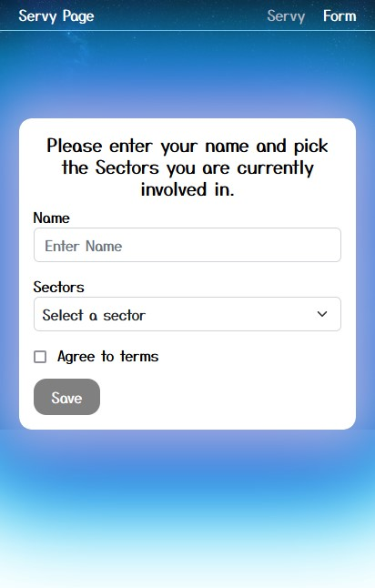

# Servy

"Servy " this is a two-page web app built with ruby on rails,React.js and redux. The servy page show about List of servy info, the form page shows about select a sector.
## Screenshoots


### Modile Version


### Deskto Version Form


### Mobile Version Form



## Built With

- HTML
- CSS
- Boobstrap
- React
- Redux
- Ruby on Rils
- Postgres


## Live Demo

- [Live link](https://not-frontend-git-dev-samiullahbahadur.vercel.app/)

## BackEnd

- [Backend link](https://github.com/samiullahbahadur/not_backend)

### Features implemented so far are:

- Project Setup with React Installations

## Built With

- React (A free and open-source front-end JavaScript library for building user interfaces based on UI components)

To get a local copy up and running follow these simple example steps.

### Prerequisites

The basic requirements for building the executable are:

- A working browser application (Google chrome, Mozilla Fire fox, Microsoft edge ...)
- VSCode or any other equivalent code editor
- Node Package Manager (For installing packages like Lighthous, webhint & stylelint used for checking for debugging bad codes before deployment)

# Getting Started

#### Cloning the project

```
git clone git@github.com:samiullahbahadur/not_frontend.git <Your-Build-Directory>
```

## Getting packages and dependencies

To get all package modules required to build the project run:

```
npm install
```

every package module required to build the project is listed in the package.json file. this is used as a reference to get all dependencies.

## Building

To build the project run:

```
npm run build
```

after you run this sucessfully you'd locate the build from in the `build` folder located from the parent directory of the project.

## Running

To run the program on a browser through a server run this command in your cli

```
npm run dev
```

This should open the page in your localhost on port 5173. then you'd be able to view the built page generated using webpack.

👤 **Author**

- GitHub: [@Samiullah Bahadur](https://github.com/samiullahbahadur)

## Show your support

Give a ⭐️ if you like this project!

## 📝 License

This project is [MIT](./MIT.md) licensed.
